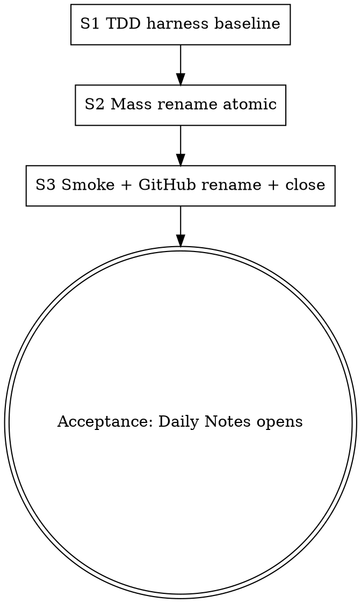

# v0.23.0 Design — Sauce rebrand + workshop-clone rename + CLI rename

> [!abstract] Goal
> Resolve the macOS APFS case-collision RUNTIME breakage from v0.22.1 by renaming the workshop clone dir away from `Beacon/` (which case-aliases the lowercase `beacon/<module>/` namespace and breaks Obsidian's vault index on macOS). Bundle a full Sauce platform rebrand: project brand, CLI binary, env vars, ASCII banner, GitHub repo. Lock the multi-cycle naming destination so v0.24.0 + v0.25.0 march toward a known target.

---

## 1. Cycle pick rationale

Locked by user via `AskUserQuestion` brainstorm 2026-05-06 (multiple rounds; conversation thread in session memory).

- **Primary trigger:** v0.22.1 post-smoke surfaced that macOS APFS case-insensitivity (`Beacon` ≡ `beacon`) breaks all 8 blueprint runtime entry points. v0.22.1 `.gitignore` patch masks `git status` symptom only — does NOT fix runtime breakage. Daily Notes "Open today's daily note" returns *"Folder 'beacon/daily' not found."* on every macOS install.
- **Brainstorm path summary:**
    1. User rejected lighthouse / beak / beam / generic Resources naming.
    2. Settled on `gravity / orbits / fabric` cosmic-physics triple + `magma` CLI.
    3. Pivoted to obsidian-mineral lineage; `magma` confirmed as CLI.
    4. Pivoted again to **Sauce** as full platform rebrand. Sauce-aesthetic for daily-driver brand.
    5. Locked: `pantry/` (workshop clone) + `spice/<module>/` (modules) + `ranch/` (runtime). CLI = `sauce`. Future mechanism additions inherit the sauce/kitchen/ranch aesthetic.

---

## 2. Final naming — LOCKED

| # | Surface | Was | Now | Cycle |
|:--:|---|---|---|:---:|
| 1 | Project brand / platform name | "Beacon" | **"Sauce"** | v0.23.0 |
| 2 | CLI binary (daily-driver verb) | `beacon` | **`sauce`** | v0.23.0 |
| 3 | Workshop clone dir (vault root) | `Beacon/` | **`pantry/`** | v0.23.0 |
| 4 | Module content namespace (vault root) | `beacon/<module>/` | **`spice/<module>/`** | v0.25.0 |
| 5 | Runtime plumbing (vault root) | `Docs/Meta/` | **`ranch/`** | v0.24.0 |
| 6 | Env var namespace | `BEACON_*` | **`SAUCE_*`** | v0.23.0 |
| 7 | GitHub repo URL | `github.com/willfell/beacon` | **`github.com/willfell/sauce`** | v0.23.0 |
| 8 | ASCII banner | `║ Beacon · installer ║` | **`║ Sauce · installer ║`** | v0.23.0 |

> [!info] Mental model
> "I dispatch sauce. My pantry stocks the platform. Each spice flavors a daily flow. The ranch corrals the runtime supplies."

---

## 3. Vault-root layout (post-v0.25.0 destination)

```
<vault>/
  pantry/                  ← workshop clone (git-managed; the platform's stocked source)
    platform/, Docs/, Scripts/, install.sh, ...
  spice/                   ← modules (each blueprint a flavor)         [v0.25.0 destination]
    daily/, boards/, meetings/, journal/, to-do/, trips/, projects/, finance/
  ranch/                   ← runtime plumbing (Scripts/Templates/...)  [v0.24.0 destination]
    Scripts/, Templates/, Templater/, Views/, rules/
  <user content>           ← personal vault content (anything else)

$ source pantry/Scripts/activate.sh
$ sauce status
```

> [!info] Intermediate state during v0.23.0
> v0.23.0 ships only Tree 1 (`pantry/`) + CLI rename + brand rebrand. After v0.23.0:
> ```
> <vault>/
>   pantry/        ← (NEW)
>   beacon/        ← modules (UNCHANGED; renames in v0.25.0)
>   Docs/Meta/     ← runtime (UNCHANGED; renames to ranch/ in v0.24.0)
> ```
> Landmine #11 wording amended to clarify the planned v0.25.0 Tree 2 rename. Module-namespace `beacon/<module>/` is held stable through v0.24.0.

---

## 4. v0.23.0 cycle scope

> [!todo]+ In scope
> - **Workshop clone dir:** `Beacon/` → `pantry/`
> - **CLI binary:** `beacon` → `sauce` (file rename `<workshop>/Scripts/beacon` → `<workshop>/Scripts/sauce`)
> - **CLI dispatcher file rename:** `platform/cli/beacon-cli.js` → `platform/cli/sauce-cli.js`
> - **Brand rebrand:** "Beacon" → "Sauce" in CLAUDE.md, READMEs, install.md, use.md, how.md, landmines.md, ASCII banner, all prose
> - **Env vars:** `BEACON_VAULT`, `BEACON_REPO_URL`, `BEACON_REPO_BRANCH` → `SAUCE_*`
> - **GitHub repo rename:** `github.com/willfell/beacon` → `github.com/willfell/sauce` (auto-redirect from old URL preserved by GitHub permanently)
> - **`.gitignore`:** DELETE the v0.22.1 root-anchored module-dir block (case-collision gone with the rename)
> - **install.md callout:** flip from `[!warning]` "case-collision" to `[!success]` "Resolved in v0.23.0"
> - **Landmines #11 + #18 wording:** updated to reference new dir names + planned future renames
> - **All 3 harnesses:** `run-install-sh.js`, `run-bootstrap.js`, `run-cli.js` updated for new paths/binary/env var

> [!example]- Deferred (queued for later cycles)
> - `Docs/Meta/` → `ranch/` (v0.24.0)
> - `beacon/<module>/` → `spice/<module>/` (v0.25.0)
> - `beacon-button` mechanism rename (v0.24.0 alongside runtime rename — name TBD; candidates: `sauce-button`, `accent-button`, sauce-themed)
> - Existing utility-named mechanisms (cards, styling, convenience, validator, audit, customjs-guard, nav-buttons) stay descriptive; future mechanisms inherit sauce/kitchen aesthetic

---

## 5. Files touched (literal call-sites)

> [!warning] API-contract-quoting discipline (v0.6.0 lesson)
> Every literal call-site below is QUOTED from the current HEAD so subagents can substitute exactly without ambiguity.

### 5.1 `install.sh`

| Line | Current | New |
|:--:|---|---|
| 2 | `# install.sh — Beacon consumer bootstrap (curl-pulled).` | `# install.sh — Sauce consumer bootstrap (curl-pulled).` |
| 7 | `REPO_URL="${BEACON_REPO_URL:-https://github.com/willfell/beacon.git}"` | `REPO_URL="${SAUCE_REPO_URL:-https://github.com/willfell/sauce.git}"` |
| 34 | `# Trap: if any later step fails after we clone Beacon/, clean it up so we` | `# Trap: if any later step fails after we clone pantry/, clean it up so we` |
| 43 | `&& [ -n "${BEACON_DIR:-}" ] && [ -d "$BEACON_DIR" ]; then` | `&& [ -n "${SAUCE_DIR:-}" ] && [ -d "$SAUCE_DIR" ]; then` |
| 44 | `printf '\n  Cleaning up partial install at %s\n' "$BEACON_DIR" >&2` | `... "$SAUCE_DIR" >&2` |
| 45 | `rm -rf "$BEACON_DIR"` | `rm -rf "$SAUCE_DIR"` |
| 52 | `printf '  ║   Beacon  ·  installer               ║\n'` | `printf '  ║   Sauce   ·  installer               ║\n'` (preserve banner-width; verify visual width) |
| 72 | `BEACON_DIR="$VAULT/Beacon"` | `SAUCE_DIR="$VAULT/pantry"` |
| 73 | `if [ -d "$BEACON_DIR" ]; then` | `if [ -d "$SAUCE_DIR" ]; then` |
| 75 | `BAK="$VAULT/Beacon.bak"` | `BAK="$VAULT/pantry.bak"` |
| 76 | `# Preserve any prior Beacon.bak by timestamping it (never destroy backups).` | `# Preserve any prior pantry.bak ...` |
| 78 | `mv "$BAK" "$VAULT/Beacon.bak.$(date +%Y%m%d-%H%M%S)"` | `... "$VAULT/pantry.bak.$(date ...)"` |
| 80 | `mv "$BEACON_DIR" "$BAK"` | `mv "$SAUCE_DIR" "$BAK"` |
| 81 | `printf '  Existing Beacon/ moved to Beacon.bak\n'` | `... pantry/ moved to pantry.bak ...` |
| 83 | `printf '  Beacon/ already exists at %s. Pass --overwrite to back up + replace.\n' "$BEACON_DIR" >&2` | `... pantry/ ... "$SAUCE_DIR" ...` |
| 87 | `printf '  Beacon/ already exists at %s\n' "$BEACON_DIR" >&2` | `... pantry/ ... "$SAUCE_DIR" ...` |
| 96 | `printf '  Beacon/ already exists at %s\n' "$BEACON_DIR"` | `... pantry/ ... "$SAUCE_DIR"` |
| 97 | `printf '  Overwrite (back up to Beacon.bak)? [y/N] '` | `... pantry.bak ...` |
| 100 | `BAK="$VAULT/Beacon.bak"` | `BAK="$VAULT/pantry.bak"` |
| 101 | (comment) | (mirror update) |
| 103 | `mv "$BAK" "$VAULT/Beacon.bak.$(date +%Y%m%d-%H%M%S)"` | `... pantry.bak ...` |
| 105 | `mv "$BEACON_DIR" "$BAK"` | `mv "$SAUCE_DIR" "$BAK"` |
| 106 | `printf '  Existing Beacon/ moved to Beacon.bak\n'` | `... pantry/ ... pantry.bak ...` |
| 115 | `printf '  [2/4] Cloning workshop into Beacon/...        '` | `... pantry/...` |
| 116 | `if ! git clone --depth=1 "$REPO_URL" "$BEACON_DIR" >/tmp/beacon-clone.log 2>&1; then` | `... "$SAUCE_DIR" >/tmp/sauce-clone.log ...` |
| 126 | `if ! (cd "$BEACON_DIR" && npm install --omit=dev) >/tmp/beacon-npm.log 2>&1; then` | `... "$SAUCE_DIR" ... /tmp/sauce-npm.log ...` |
| 136 | `NODE_ARGS=("$BEACON_DIR/platform/cli/beacon-cli.js" "bootstrap" "--vault" "$VAULT")` | `... "$SAUCE_DIR/platform/cli/sauce-cli.js" ...` |

### 5.2 `platform/cli/beacon-cli.js` → `platform/cli/sauce-cli.js` (git mv)

| Line | Current | New |
|:--:|---|---|
| 2 | `// platform/cli/beacon-cli.js — Beacon CLI dispatcher.` | `// platform/cli/sauce-cli.js — Sauce CLI dispatcher.` |
| 3 | `// Resolves vault context (cwd ancestor walk; $BEACON_VAULT fallback) and` | `// ... $SAUCE_VAULT fallback ...` |
| 31 | `if (!vaultPath && env.BEACON_VAULT) {` | `if (!vaultPath && env.SAUCE_VAULT) {` |
| 32 | `if (fs.existsSync(path.join(env.BEACON_VAULT, "Docs/Meta/platform-config.json"))) {` | `... env.SAUCE_VAULT ...` |
| 33 | `vaultPath = env.BEACON_VAULT;` | `vaultPath = env.SAUCE_VAULT;` |
| 37 | `throw new Error("Not inside a beacon-managed vault. cd into one or set BEACON_VAULT.");` | `throw new Error("Not inside a sauce-managed vault. cd into one or set SAUCE_VAULT.");` |

### 5.3 `platform/bootstrap.js`

| Line | Current | New |
|:--:|---|---|
| 3 | `* Beacon consumer bootstrap — interactive Node CLI (v0.22.0 S2).` | `* Sauce consumer bootstrap — interactive Node CLI (v0.23.0).` |
| 6 | `*   node ../beacon/platform/bootstrap.js` | `*   node ../sauce/platform/bootstrap.js` |
| 172 | `const cliPath = path.join(workshopAbsPath, "platform/cli/beacon-cli.js");` | `... "platform/cli/sauce-cli.js"` |
| 174 | `const binPath = path.join(scriptsDir, "beacon");` | `... "sauce"` |
| 175 | `const actBody = ` `# Beacon activation — sourced into your shell.` | `# Sauce activation — sourced into your shell.` |
| 177 | `export BEACON_VAULT="${vaultPath}"` | `export SAUCE_VAULT="${vaultPath}"` |

### 5.4 `platform/bootstrap-lib/wizard.js`

| Line | Current | New |
|:--:|---|---|
| 100 | `(defaults && defaults.workshopRelativePath) \|\| "Beacon";` | `... \|\| "pantry";` |
| 180 | `(defaults && defaults.workshopRelativePath) \|\| "Beacon";` | `... \|\| "pantry";` |
| 378 | `existingConfig.workshop_relative_path \|\| "../beacon";` | `... \|\| "pantry";` (note: this is the post-v0.22.0 inside-vault default; verify in S2 that `../beacon` legacy is no longer referenced) |

### 5.5 Other `platform/cli/` files

`cmd-bootstrap.js`, `cmd-status.js`, `cmd-update.js`, `cmd-wizard.js` — review during S2 for `beacon-cli` references in doc-strings + imports; update to `sauce-cli`.

### 5.6 Documentation

- **`Docs/install.md`** — every `Beacon/` → `pantry/`; every `beacon` (CLI verb) → `sauce`; every `BEACON_*` env var → `SAUCE_*`; flip `[!warning]` callout (lines ~99-110) to `[!success]` "Resolved in v0.23.0 — workshop clone renamed to pantry/, eliminating the macOS APFS case-collision with the lowercase beacon/ namespace"; add upgrade-from-v0.22.x recipe.
- **`Docs/landmines.md`** — #18 wording: "the workshop clone dir is git-managed (currently `pantry/` since v0.23.0; previously `Beacon/`)"; #11 wording note: "module namespace stays `beacon/<module>/` through v0.24.0; planned rename to `spice/<module>/` in v0.25.0".
- **`Docs/use.md`** — every CLI verb `beacon …` → `sauce …`; every `Beacon/` → `pantry/`.
- **`Docs/how.md`** — same; CLI surface section header update.
- **`CLAUDE.md`** — non-negotiable section, ask-before-acting list, status snapshot, every `Beacon/` → `pantry/`, every `beacon` (CLI) → `sauce`, every brand reference "Beacon" → "Sauce". The full v0.21.1 / v0.22.0 / v0.22.1 status entries stay as historical record (don't rewrite history); v0.23.0 status entry added with rebrand summary.
- **READMEs** (root + platform/) — rebrand prose.

### 5.7 `.gitignore`

DELETE the v0.22.1-added block (lines from `# v0.22.1: macOS APFS case-insensitivity collides ...` through `/trips/` inclusive). Keep `node_modules/`. Add no new entries.

### 5.8 Workshop self-config + consumer configs

- **Workshop's `Docs/Meta/platform-config.json`** — `workshop_relative_path` value: verify current value (likely `.` or unset since workshop self-installs in place); document during S2.
- **`barebones-beacon-poc/Docs/Meta/platform-config.json`** — `workshop_relative_path: "Beacon"` → `"pantry"` (manual `sed -i ''` or hand-edit during S3 smokes).
- **`accuris-beacon-poc/Docs/Meta/platform-config.json`** — same.
- **scratch/2, scratch/3, scratch/4** — these are v0.22.x smoke targets; nuke + fresh bootstrap if needed.

### 5.9 Harnesses (3 files; all paths/vars rename; counts STAY same)

> [!info] Harness count expectations
> `run-install-sh.js`: 14 → 14 (paths only); `run-bootstrap.js`: 45 → 45; `run-cli.js`: 20 → 20. No new test cases needed for v0.23.0 — pure rename.

| Harness | Affected cases | Changes |
|---|---|---|
| `run-install-sh.js` | I3, I4, I5, I6, I7, I8 | Every `path.join(vaultPath, "Beacon")` → `... "pantry"`; every `Beacon.bak` → `pantry.bak`; every label string; `cli/beacon-cli.js` → `cli/sauce-cli.js`; binary expectation `/Scripts/beacon` → `/Scripts/sauce` |
| `run-bootstrap.js` | BS10-BS13 | `workshopAbs = path.join(vaultPath, "Beacon")` → `... "pantry"`; rename function `caseBS11WizardDefaultsBeacon` → `caseBS11WizardDefaultsPantry`; assertion `r.config.workshop_relative_path === "Beacon"` → `=== "pantry"`; activate.sh body assertion `BEACON_VAULT="..."` → `SAUCE_VAULT="..."` |
| `run-cli.js` | C1-C14 | Every stub config `workshop_relative_path: "Beacon"` → `"pantry"`; every `path.join(vaultPath, "Beacon")` → `... "pantry"`; `BEACON_VAULT` env-var tests (C2, C3) → `SAUCE_VAULT`; label strings updated |

---

## 6. Migration

> [!success] No migration tooling needed (user-locked)
> User confirmed: "no real vaults are utilizing." During S3:
> - Workshop dogfood: in-place (no clone dir; runs install.js against own root).
> - `barebones-beacon-poc` + `accuris-beacon-poc`: manual `mv Beacon pantry` + `sed` on `workshop_relative_path`.
> - `scratch/2`, `scratch/3`, `scratch/4`: nuked + re-bootstrapped from updated install.sh (or just left alone — they're historical smoke targets).
> - Fresh `scratch/5`: clean curl-bootstrap from new HEAD.

**install.md "Upgrading from v0.22.x" section (added in v0.23.0):**

```bash
cd <vault>
mv Beacon pantry                                                                # noop on Linux/case-sensitive
sed -i '' 's/"workshop_relative_path": "Beacon"/"workshop_relative_path": "pantry"/' Docs/Meta/platform-config.json
source pantry/Scripts/activate.sh
sauce status
```

---

## 7. GitHub repo rename mechanics

> [!warning] User approval gates two destructive remote operations
> - `gh repo rename sauce` — renames the GitHub repo. Auto-redirect from old URL is permanent (GitHub guarantees it for renames). Tag history preserved.
> - `git remote set-url origin git@github-personal:willfell/sauce.git` — updates local clone's remote URL. Required after rename so future `git push` lands on the new URL.
>
> Both happen during S3 cycle close, AFTER acceptance gate passes. User explicit approval required at that moment.

**Verification post-rename:**
- `git remote -v` shows `git@github-personal:willfell/sauce.git`
- `git push origin main` succeeds against new URL
- `git ls-remote --tags origin` shows all historical tags (v0.1.0 through v0.22.1) preserved
- Old URL `https://github.com/willfell/beacon` redirects to `https://github.com/willfell/sauce` in browser

---

## 8. Cycle shape (3 stages)



### S1 — TDD harness baseline (1 commit)

- Update 3 harnesses to expect new behavior (`pantry/` paths, `sauce` binary, `SAUCE_*` env vars).
- Run all 5 harnesses pre-impl: `run-install-sh.js`/`run-bootstrap.js`/`run-cli.js` RED; `run-helper-cases.js`/`run-renderer.js` GREEN (unchanged).
- Commit `test(v0.23.0): S1 TDD baseline — failing harness for sauce/pantry/sauce-cli rename`.

### S2 — Mass rename atomic (1 commit)

- `git mv platform/cli/beacon-cli.js platform/cli/sauce-cli.js`.
- Find-and-replace across `install.sh` + `platform/` (CAREFUL: exclude `Docs/plans/` historical writeups + blueprint module-namespace `beacon/<module>/` in path checks per Tree 2 deferral; preserve mechanism name `beacon-button` since rename queues for v0.24.0).
- Update `bootstrap.js` activate.sh template + wizard.js defaults.
- DELETE `.gitignore` v0.22.1 root-anchored block.
- Update install.md callout, use.md, how.md, landmines (#11 + #18), CLAUDE.md.
- Run all 5 harnesses GREEN.
- Workshop self-install green idempotent: `node platform/test/run-install.js .` exit 0.
- Commit `feat(v0.23.0): S2 — Beacon→Sauce rebrand + Beacon/→pantry/ + beacon→sauce CLI`.

### S3 — Smoke + GitHub rename + cycle close (3-4 commits)

1. **Manual mv consumer dirs** — `barebones-beacon-poc` + `accuris-beacon-poc`: `mv Beacon pantry` + sed on platform-config.json. Verify `sauce status` green.
2. **Fresh smoke target** — `bash install.sh --vault=/Users/willfell/scratch/5 --non-interactive --mechanisms=all --blueprints=all`. Verify `<vault>/pantry/` exists; `<vault>/beacon/daily/` materializes (Tree 2 unchanged); `git status` clean.
3. **🔴 ACCEPTANCE GATE** — open `/Users/willfell/scratch/5` in Obsidian; click Daily Notes "Open today's daily note". **Expected: SUCCESS** (creates `beacon/daily/2026/05-May/2026-05-06-Wednesday.md`). The macOS APFS case-collision bug is fixed at the root.
4. **Docs update commit** — install.md callout flipped, use.md/how.md, CLAUDE.md status snapshot.
5. **GitHub repo rename** (USER APPROVAL REQUIRED) — `gh repo rename sauce` + `git remote set-url origin git@github-personal:willfell/sauce.git`.
6. **Workshop_version bump** — `0.22.1 → 0.23.0` in `platform/manifest.json`.
7. **Cycle-close commit + push** — `docs(v0.23.0): cycle close — workshop_version 0.22.1 → 0.23.0 MINOR (Sauce rebrand)`.
8. **Annotated tag `v0.23.0`** (USER APPROVAL REQUIRED) — push to origin/main.

---

## 9. Reserved-headroom expectation

> [!info] Mixed-case cycle (similar to v0.22.1)
> Wide-touching mechanical mass-rename + brand prose. Expect 2-4 CFs from missed call-sites:
> - sed regex collision: `beacon-button` mechanism dir/file/class name MUST NOT match the `beacon` brand-rename. Need careful word-boundary regex `\bbeacon\b` not `beacon`.
> - Doc references in obscure places (Docs/plans/ historical writeups should NOT be rewritten — preserve cycle-time accuracy per CLAUDE.md convention).
> - Internal env-var reference in comments + log file names (`/tmp/beacon-clone.log`, `/tmp/beacon-npm.log` → `/tmp/sauce-*.log`).
> - Two-stage subagent review (spec then quality) load-bearing per v0.20.0 lesson d + v0.22.1 reaffirmation.

**Reserved-headroom precedent extends to 10 data points post-v0.23.0.** Wide-touching first-of-its-kind brand-rebrand expected to USE 1-3 CFs.

---

## 10. Acceptance gate

> [!success] Manual smoke is the close gate
> Fresh `<vault>/scratch/5` curl-bootstrap on macOS APFS. Open Daily Notes → SUCCESS. The v0.22.1 RUNTIME breakage is fixed by the rename.
>
> Without that, the cycle is incomplete — even with all 5 harnesses green.

Secondary verification:
- `sauce status` green idempotent in barebones + accuris + scratch/5.
- `git ls-remote --tags origin` after GitHub rename shows all v0.* tags preserved.
- `gh api repos/willfell/sauce` returns 200; `gh api repos/willfell/beacon` returns redirect.

---

## 11. Constraints carried forward (non-negotiable)

> [!warning] CLAUDE.md non-negotiables + landmines
> - **In-cycle re-process bump rule (#16)** — any in-cycle revision after first install MUST bump version. Applies if any mechanism/blueprint manifest is touched (none planned in v0.23.0).
> - **Allowlist 11 paths (#12)** — UNCHANGED in v0.23.0. Adding 12th+ requires explicit user approval.
> - **Stub content-static (#13)** — never re-edit any consumer's `Docs/Meta/Templater/platformInstall.js` body. The thin stub reads `workshop_relative_path` at runtime; it adapts automatically when consumers update their config.
> - **Bootstrap network posture (#17)** — install.sh + CLI verbs are network gateways; `install.js` stays filesystem-only. Renaming preserves this separation.
> - **Module-directory invariant (#11)** — UNCHANGED in v0.23.0; rename to `spice/<module>/` queues for v0.25.0. Landmine wording amended to forecast the planned rename.
> - **Inside-vault clone is git-managed (#18)** — wording amended in v0.23.0 to reference `pantry/` instead of `Beacon/`.
> - **API-contract quoting (v0.6.0 lesson)** — every literal call-site QUOTED in section 5 above so subagents substitute exactly.
> - **Two-stage subagent review (v0.20.0 lesson d)** — spec compliance + code quality. Both required for S2 atomic commit.
> - **Per-blueprint version bumps require LOCKSTEP edits** — N/A in v0.23.0 (no blueprint manifest changes).
> - **Ask before acting:** `workshop_version` bump, force-push, history rewrite, tag deletion, **GitHub repo rename**, modifying any consumer's stub body, editing `platform/installer-stub.js`, creating top-level vault directory (v0.23.0 codifies a NEW sanctioned top-level: `pantry/` replacing `Beacon/`).

---

## 12. Open questions / risks

| Risk | Mitigation |
|---|---|
| sed regex collision on `beacon-button` mechanism name | Use word-boundary `\bbeacon\b` regex; whitelist `beacon-button` directories explicitly; spot-check `git diff` for accidental matches in S2 review. |
| GitHub repo rename breaks any external pinned URLs (e.g., `BEACON_REPO_URL` overrides someone may have set) | Auto-redirect handles browser + git clone. install.sh still honors `${SAUCE_REPO_URL:-https://github.com/willfell/sauce.git}` env var. v0.22.x users who set `BEACON_REPO_URL` need to update to `SAUCE_REPO_URL`; documented in install.md upgrade recipe. |
| Stub md5 invariant — does it change? | Stub at `platform/installer-stub.js` references workshop relative path at runtime; the path comes from consumer's `platform-config.json:workshop_relative_path`, not from the stub body. Stub md5 STAYS `a39257da1dd49ae4481e5cd0a42bdac4`. Verify in S2 (deliberate non-edit). |
| Tag history fragmentation if GitHub rename mid-cycle fails | GitHub repo rename happens AFTER acceptance gate + AFTER cycle-close commit lands locally. If rename fails, push to old URL still works (the local remote URL is still pointing at `beacon`). Worst case: defer rename to v0.23.1; not a cycle-blocker. |
| User-side shell rc-files exporting `BEACON_VAULT` | install.md upgrade recipe instructs `export SAUCE_VAULT=...`. Optional honor-both pattern (`SAUCE_VAULT \|\| BEACON_VAULT`) rejected — clean break preferred per "no migration tooling" lock. |

---

## 13. Carry-forwards (queued for later cycles)

- **v0.24.0 — Tree 3 rename + beacon-button rename.** `Docs/Meta/` → `ranch/`. Updates `templates_path` / `scripts_path` / `views_path` variables in every consumer config + every blueprint manifest's path references. Helper code paths. `beacon-button` mechanism rename (suggested: `accent-button` or sauce-themed) bundled here.
- **v0.25.0 — Tree 2 rename.** `beacon/<module>/` → `spice/<module>/`. Most call-site-heavy of the three: every blueprint manifest's `module_directory`, every Templater path, every wikilink, ProjectsHubCards filter (`etags.includes("#project")` stays; path filter `pathParts[tripsIdx-1] !== "beacon"` updates to `"spice"`).
- **Multi-theme presets** — DEFERRED again from v0.21.1 / v0.22.0 / v0.22.1. v0.26.0+ candidate.
- **Architectural install.js refactor** — helpers signal NO_OP_DUE_TO_MISSING_PREREQ to orchestrator (carried from v0.21.0).
- **Project Sub-tasks panel + finance polish + cross-doc lint** — long-tail carries.

---

## 14. Final lock — naming + cycle plan summary

| Decision | Locked-in value |
|---|---|
| Brand | **Sauce** |
| CLI binary | **`sauce`** |
| Workshop clone dir | **`pantry/`** |
| Module namespace | `beacon/<module>/` (v0.23.0/v0.24.0); **`spice/<module>/`** (v0.25.0) |
| Runtime plumbing | `Docs/Meta/` (v0.23.0); **`ranch/`** (v0.24.0+) |
| Env var namespace | **`SAUCE_*`** |
| GitHub repo | **`github.com/willfell/sauce`** |
| Migration tooling | None (user-locked: "no real vaults are utilizing") |
| `.gitignore` v0.22.1 patterns | Removed |
| Cycle scope (v0.23.0) | Tree 1 + CLI + brand + env + GitHub rename |
| Cycle staging | v0.23.0 / v0.24.0 / v0.25.0 (one tree per cycle) |
| Workshop_version | 0.22.1 → 0.23.0 (MINOR) |

End of design.
