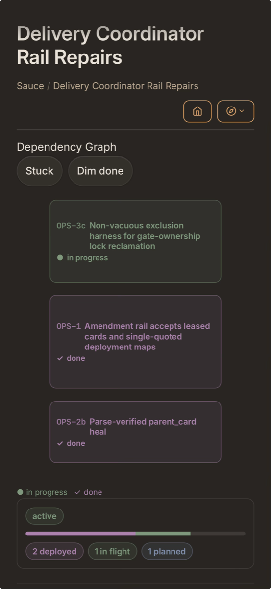
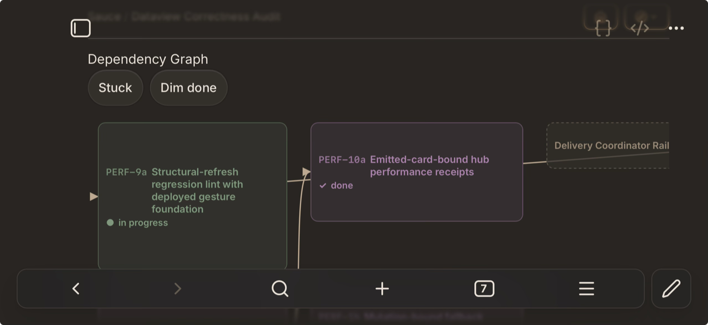

# Sauce

> Obsidian but with the Sauce.

Sauce turns your Obsidian vault into an operating loop for AI agents: notes become node-based work graphs, agents execute them in isolated workers, and results land back in the vault.

## What it is

Sauce is an engine that runs typed graphs of agent work from notes in an Obsidian vault, plus a versioned platform (mechanisms and blueprints) that installs into any vault through Homebrew. A graph note declares nodes (`agent`, `judge`, `shell`, `human`, `end`) and edges with outcomes and retry budgets; `sauce run <note>` executes it, each agent step in its own git worktree, and writes an append-only ledger and a `## Runs` section back into the note.

## 30 seconds, one task

1. You write a note from the `Sauce Graph` template: an `implement` node on Claude Code, a `verify` node that runs your tests, a `review` node on Codex, and a `ship` node that waits for you. Two edges carry retry budgets.
2. `sauce run "spice/graphs/fix-flaky-harness.md" --follow`. The engine creates a worktree, runs Claude Code with the prompt, reads the `result.json` it publishes, fires the edge to `verify`.
3. `verify` fails. The `on: fail, max: 2` edge sends the work back to `implement`, which starts from the same branch. The second attempt passes.
4. `review` runs Codex against the branch with the upstream summary as context and passes.
5. The run parks on `ship`. Your note now shows every node's outcome and one checkbox: `- [ ] run:fix-flaky-harness-… node:ship — Open a PR from this branch?`
6. You tick it in Obsidian. The next `sauce run` (or the launchd job) resumes and finishes. The ledger at `ranch/engine/runs/<run-id>.jsonl` is the record.

Every step above is in the `Docs/engine.md` reference, including the real ledger from that run.

## How it works

```mermaid
flowchart LR
    note["Obsidian note<br/>type: sauce-graph"] --> graph["Sauce graph<br/>nodes + edges"]
    graph --> dispatcher["Dispatcher<br/>sauce run: tick, fire edges,<br/>append ledger"]
    dispatcher --> w1["Worker: Claude Code<br/>git worktree"]
    dispatcher --> w2["Worker: Codex<br/>git worktree"]
    dispatcher --> judge["Judge / shell<br/>tests, gates, receipts"]
    w1 --> results["result.json"]
    w2 --> results
    judge --> results
    results --> dispatcher
    dispatcher --> back["Back into the vault<br/>ranch/engine/runs/*.jsonl<br/>## Runs section, human checkbox"]
    back --> note
```

Nodes run to completion inside a tick. Edges decide what runs next, with per-edge retry budgets; a cycle with no budget is refused before anything starts. A worker's verdict is the `result.json` it publishes by rename, never a parsed transcript. A `human` node parks the run on a checkbox in the note and resumes when you tick it. State is one append-only file per run in the vault, so Obsidian Sync carries it between machines.

## What it looks like

Work lives in the vault, so you read it the way you read any other note, including on a phone. These show the project blueprint's read-only views over the delivery board that the coordinator drives and the `mayo` plugin fronts, drawn from the same card notes the coordinator writes.

<p align="center">
  
</p>

One epic and its slices, with a rollup underneath. In this screenshot the graph draws three cards while the rollup counts four. That fourth count was a bug: OPS-3b had been superseded by OPS-3c, and the rollup was counting it as planned work. Captioning this image is how it was found; it was fixed in v0.292.1 (#857), and the screenshot predates the fix.

<p align="center">
  
</p>

A wider graph, cropped. The dashed node is a stub standing in for a dependency that lives in another epic, drawn as a placeholder instead of pulling that epic's work into this view. `Stuck` and `Dim done` fade parts of the graph rather than removing them, so the shape stays put while your attention moves.

Card status is a projection of the coordinator's ledger rather than something typed by hand. It can still be written by something else, and the loop expects that: dragging a card in the Kanban board on your phone changes the note, and the coordinator records a foreign write against the hash it last wrote instead of quietly trusting it. A board-health check surfaces those, and the `adopt` verb is how out-of-band work gets back on the rail.

The engine's own surface is the same idea one level down: a graph note's `## Runs` section, showing each node's outcome and any checkbox waiting on you. See [`Docs/engine.md`](Docs/engine.md).

## Install

Requires macOS or Linux with [Homebrew](https://brew.sh), Node 18+, and the `claude` or `codex` CLI for real agent nodes (the `fake` worker needs neither).

```bash
brew tap willfell/sauce
brew install willfell/sauce/sauce
sauce bootstrap --vault /path/to/your/vault
```

`bootstrap` walks you through which blueprints to install. The engine is always on: every vault gets `/sauce`, the `Sauce Graph` template, and `ranch/engine/`. Then:

```bash
sauce run "<note>" --dry-run          # validate and print the plan
sauce run "<note>" --follow           # run it
sauce run "<note>" --install-launchd  # run it unattended on an interval
sauce audit --engine                  # prove the install
```

Upgrade with `brew upgrade willfell/sauce/sauce && sauce update`.

## Plugins

Plugins sit on top of the engine. The one that ships in this repo is **mayo** (`plugins/mayo`), the delivery-loop skill surface for Claude Code and Codex: bind a repo to a Kanban board in a vault (`/mayo:init`), turn requirements into epics and slices (`/mayo:intake`, `/mayo:plan`), and drive them through a deterministic coordinator with an adequacy gate, a three-lens review quorum, and receipts all the way to deploy (`/mayo:run`, `/mayo:status`, `/mayo:review`). Its slice pipeline is also shipped as a graph, `platform/engine/graphs/delivery-slice.md`; running it through the engine is opt-in in this release. Install with `/plugin marketplace add willfell/sauce` then `/plugin install mayo@sauce`. See `Docs/agent-guides/mayo-plugin.md`.

## The vault platform

Under the engine, Sauce is still the platform it started as: **mechanisms** (cross-cutting code) and **blueprints** (note-type bundles for daily notes, meetings, projects, tasks, finance, wiki, reading queue, and more) that a vault subscribes to and the installer materializes, upgrades, and audits. If you have ever copy-pasted Templater scripts between vaults or lost a Dataview view in a sync conflict, this half is for you.

| Path | Purpose |
| --- | --- |
| `platform/engine/` | The engine runtime (shipped in the brew `libexec`) |
| `platform/mechanisms/`, `platform/blueprints/` | Canonical platform source |
| `platform/cli/` | The `sauce` CLI (`run`, `bootstrap`, `update`, `audit`, ...) |
| `plugins/mayo/` | The delivery-loop plugin |
| `ranch/` | Runtime plumbing materialized into consumer vaults |
| `spice/` | Module-directory namespace for blueprint content (consumer-side) |
| `Docs/` | All documentation; start at `Docs/Index.md` |

## Documentation

- [`Docs/engine.md`](Docs/engine.md) — the engine reference: graph syntax, node and edge reference, scheduling, isolation, limitations, a real ledger.
- [`Docs/comparison.md`](Docs/comparison.md) — how Sauce compares to Gas Town-style orchestration, beads-superpowers, and plain Claude Code loops.
- [`Docs/getting-started.md`](Docs/getting-started.md) — zero to a working vault, end to end.
- [`Docs/Index.md`](Docs/Index.md) — full doc index (`why.md`, `how.md`, `use.md`, `landmines.md`).
- [`Docs/agent-guides/mayo-plugin.md`](Docs/agent-guides/mayo-plugin.md) — the mayo plugin runbook.

## Status

Pre-1.0 and solo-developed. The engine shipped in this cycle with the `fake` worker exercised end to end by the harnesses; the Claude Code and Codex adapters are thin shell-outs. The delivery-slice graph is opt-in and has not yet driven a live epic. Worktrees are the only isolation; there is no sandbox. APIs, graph syntax, and blueprint shapes may change between minor versions. Cycle history lives in [`Docs/cycle-history.md`](Docs/cycle-history.md), per-cycle design/plan/result docs in [`Docs/plans/`](Docs/plans/), and the changelog in [`CHANGELOG.md`](CHANGELOG.md).

## Security

See [`SECURITY.md`](SECURITY.md) for the vulnerability-reporting process.

## Contributing

See [`CONTRIBUTING.md`](CONTRIBUTING.md); please open an issue before sending a PR.

## License

MIT, see [`LICENSE`](LICENSE).
