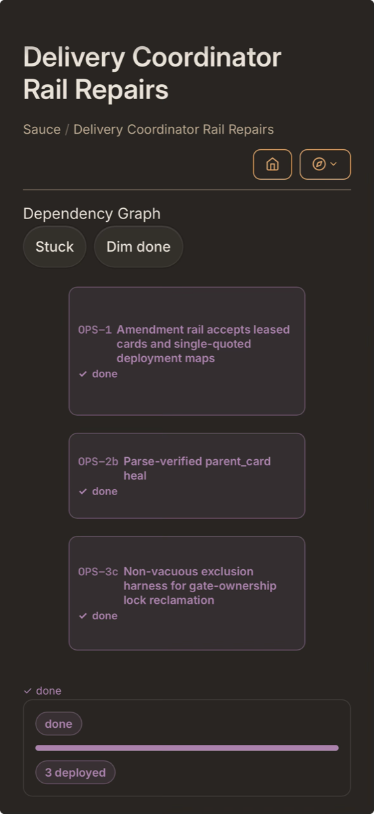
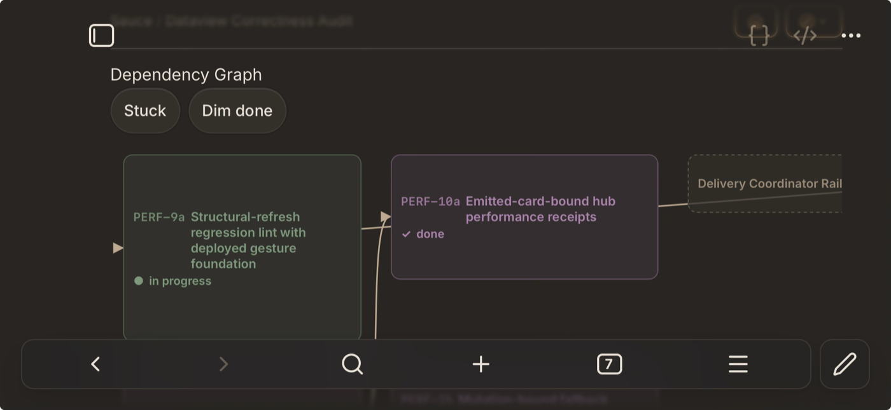

# Sauce

> Obsidian but with the Sauce.

Sauce is an operating system for an Obsidian vault that you and your agents both use.

It installs a versioned set of **blueprints** (daily notes, projects, meetings, tasks, finance, trips, wiki, reading queue, people, and more) and shared **mechanisms** into any vault through Homebrew. Every blueprint works by hand in Obsidian, with hubs, buttons, templates, and boards. Most also ship Claude Code slash commands and skills, so an agent can work on the same notes you do. On top of that sit scheduled briefings (cowork), a graph engine that runs agent work from a note (`sauce run`), and a delivery loop that drives a Kanban board through review and release.

## What you get

A vault subscribes to the blueprints it wants. The installer materializes them, upgrades them, and audits them for drift.

| Blueprint | What it gives you in Obsidian | Agent command |
| --- | --- | --- |
| `home` | A command center: greeting, quick capture, today's dashboard | `/home` |
| `daily` | One note per day with a dashboard panel, a nav button, and a hotkey | `/daily` |
| `to-do` | Date-routed daily to-do notes and a recurring-tasks registry | |
| `journal` | A multi-entry journal with per-day hubs and timestamped entries | `/journal` |
| `sticky-notes` | Quick-capture notes with per-day hubs | `/sticky-notes` |
| `meetings` | A per-day meetings hub and individual meeting notes with attendees | `/meetings` |
| `people` | One note per person and a People hub | |
| `project` | A per-project atlas, map, Kanban board, hierarchical tasks, epics, and a dependency graph | `/project` |
| `boards` | A Kanban to-do board with date-routed card notes | |
| `products`, `teams` | An org chart: products, the teams under them, and the projects they own | `/products`, `/teams` |
| `wiki` | A knowledge base of any depth where the folder path is the hierarchy | `/wiki` |
| `reader` | A flat reading queue for clipped web articles | `/reader` |
| `trips` | A folder per trip: atlas, flights, stay, packing list, to-do, notes | |
| `finance` | A finance hub over budgets, paychecks, invoices, and debts | |
| `cowork` | Daily, weekly, and monthly hubs fed by scheduled agent briefings | `/cowork`, `/weekly`, `/monthly` |

Blueprints without an agent command are still plain Markdown that an agent can read and write. They just do not ship a dedicated command yet.

Underneath, mechanisms carry everything blueprints share: rendering primitives (cards, breadcrumbs, the chrome bar, navigation buttons), a validator and an audit walker, declarative "New X" buttons, task handling, Kanban status sync, people identity, styling, and the agent-facing pieces described below.

## Two doors into the same vault

The point of Sauce is that there is one vault and two ways to work in it. Neither is a second-class path, and neither needs the other.

**By hand, in Obsidian.** You open a hub, press a navigation button, press "New meeting", use a hotkey, drag a card across a Kanban board, or tick a checkbox on your phone. Notes are created from templates with the right frontmatter, and hubs find them by folder and frontmatter.

**By agent, from a terminal or a schedule.** Claude Code runs a slash command or a skill against the same vault. Codex and other agents can read and write the same Markdown, but the installer ships the commands, skills, and router for Claude Code only. The installer writes a router table into the vault's `CLAUDE.md`, so an agent knows where each kind of note lives and which command owns it without searching.

The same artifact answers to both:

| You want to | By hand | By agent |
| --- | --- | --- |
| Open today's note | The Daily nav button or hotkey | `/daily` |
| Create a meeting | The "New meeting" button on the Meetings hub | The `new-meeting` skill, using the same template |
| Move a task forward | Drag its card to another column | The delivery coordinator projects status onto the same card |
| Approve agent work | Tick a checkbox in the note | The engine resumes the run on its next tick |
| Check the vault for drift | Type `/audit` in the editor | `/audit` in Claude Code |

Both writers are held to the same rules. The validator and the audit check notes regardless of who wrote them, and a schema registry covers the frontmatter both depend on. When a person changes something an agent is tracking, the agent side records it as a foreign write instead of overwriting it.

## Install

Requires macOS or Linux with [Homebrew](https://brew.sh) and Node 18+. The `claude` or `codex` CLI is only needed for the agent features.

```bash
brew tap willfell/sauce
brew install willfell/sauce/sauce
sauce bootstrap --vault /path/to/your/vault
```

`bootstrap` walks you through which blueprints to install, fetches the Obsidian community plugins they depend on, and registers the vault on this machine. Two mechanisms are always installed: `platform-claude` (the `CLAUDE.md` router and the `/install`, `/upgrade`, `/bootstrap` commands) and `engine` (`/sauce`, the `Sauce Graph` template, and `ranch/engine/`).

Upgrade with:

```bash
brew upgrade willfell/sauce/sauce
sauce update --bump-pins     # from inside a vault: move its pins to the new catalogue and reinstall
sauce reinstall --all        # or: re-run the installer across every registered vault at its current pins
```

Useful read-only checks: `sauce status` (drift and subscriptions), `sauce doctor` (machine health), `sauce audit` (blueprint conformance).

## Agents in the vault

There are four agent surfaces. They are independent, and you can use any of them without the others.

### Slash commands and skills

Each blueprint with an agent surface installs its command under `.claude/commands/` and its skills under `.claude/skills/`. Your own overrides go in `.claude/commands.local/` and `.claude/skills.local/` and survive upgrades. The optional `agent-embed` mechanism puts Claude Code or Codex in a pane inside Obsidian.

### Cowork: scheduled briefings

The `cowork` blueprint defines five scheduled cadences: morning briefing, midday tripwire, end-of-day review, weekly review, and monthly review. A scheduler such as Claude Cowork runs them against the vault over MCP. Each run writes one note at a deterministic path, and the Daily, Weekly, and Monthly hubs surface it next to what you wrote by hand. See [`Docs/cowork-vision.md`](Docs/cowork-vision.md).

### The engine: agent work as a graph note

A graph note declares nodes (`agent`, `judge`, `shell`, `human`, `end`) and edges with outcomes and retry budgets. `sauce run <note>` executes it, each agent step in its own git worktree, and writes an append-only ledger and a `## Runs` section back into the note.

```mermaid
flowchart LR
    note["Obsidian note<br/>type: sauce-graph"] --> graph["Sauce graph<br/>nodes + edges"]
    graph --> dispatcher["Dispatcher<br/>sauce run: tick, fire edges,<br/>append ledger"]
    dispatcher --> w1["Worker: Claude Code<br/>git worktree"]
    dispatcher --> w2["Worker: Codex<br/>git worktree"]
    dispatcher --> judge["Judge / shell<br/>tests, gates, receipts"]
    w1 --> results["result.json"]
    w2 --> results
    judge --> results
    results --> dispatcher
    dispatcher --> back["Back into the vault<br/>ranch/engine/runs/*.jsonl<br/>## Runs section, human checkbox"]
    back --> note
```

A short example. You write a note from the `Sauce Graph` template: an `implement` node on Claude Code, a `verify` node that runs your tests, a `review` node on Codex, and a `ship` node that waits for you. `verify` fails, so the `on: fail, max: 2` edge sends the work back to `implement`. The second attempt passes, `review` passes, and the run parks on `ship` with one checkbox in the note. You tick it in Obsidian, and the next `sauce run` finishes.

```bash
sauce run "<note>" --dry-run          # validate and print the plan
sauce run "<note>" --follow           # run it
sauce run "<note>" --install-launchd  # run it unattended on an interval
sauce audit --engine                  # prove the install
```

A worker's verdict is the `result.json` it publishes by rename, never a parsed transcript. State is one append-only file per run in the vault, so Obsidian Sync carries it between machines. The full reference is [`Docs/engine.md`](Docs/engine.md).

### The delivery loop: a Kanban board that ships code

The **sauce** plugin (`plugins/sauce`) binds a code repository to a project board in a vault. You turn requirements into epics and slices (`/sauce:propose`, `/sauce:plan`, `/sauce:intake`). A deterministic coordinator then drives each slice through an adequacy gate, a three-lens review quorum, a pull request, release, and deploy, with a receipt at every step (`/sauce:loop`, `/sauce:status`, `/sauce:review`). Install it with `/plugin marketplace add willfell/sauce` then `/plugin install sauce@sauce`. See [`Docs/agent-guides/sauce-plugin.md`](Docs/agent-guides/sauce-plugin.md).

The board is an ordinary project-blueprint board, so you read it the way you read any other note, including on a phone.

<p align="center">
  
</p>

One epic and its slices, with a rollup underneath. All three slices are done, and the rollup counts three deployed. Slices they superseded are not drawn and not counted.

<p align="center">
  
</p>

A wider graph, cropped. The dashed node is a stub standing in for a dependency that lives in another epic. `Stuck` and `Dim done` fade parts of the graph rather than removing them, so the shape stays put while your attention moves.

Card status is a projection of the coordinator's ledger rather than something typed by hand. It can still be written by something else, and the loop expects that. Dragging a card in the Kanban board on your phone changes the note, and the coordinator records a foreign write against the hash it last wrote instead of quietly trusting it. A board-health check surfaces those, and the `adopt` verb is how out-of-band work gets back on the rail.

The slice pipeline is also shipped as an engine graph, `platform/engine/graphs/delivery-slice.md`. Running the loop through the engine is opt-in in this release.

## How it is built

**Mechanisms** are cross-cutting code. **Blueprints** are note-type bundles built on them. A vault keeps a subscription with a pinned version for each, and the installer materializes exactly that. If you have ever copy-pasted Templater scripts between vaults or lost a Dataview view in a sync conflict, this is the part that fixes it: author once, subscribe per vault, update on demand, audit drift always.

| Path | Purpose |
| --- | --- |
| `platform/mechanisms/`, `platform/blueprints/` | Canonical platform source |
| `platform/cli/` | The `sauce` CLI (`bootstrap`, `update`, `reinstall`, `status`, `audit`, `doctor`, `run`, ...) |
| `platform/engine/` | The engine runtime (shipped in the brew `libexec`) |
| `plugins/sauce/` | The delivery-loop plugin |
| `ranch/` | Runtime plumbing materialized into consumer vaults (config, scripts, templates, views) |
| `spice/` | Module-directory namespace for blueprint content (consumer-side) |
| `Docs/` | All documentation; start at `Docs/Index.md` |

## Documentation

- [`Docs/getting-started.md`](Docs/getting-started.md): zero to a working vault, end to end.
- [`Docs/use.md`](Docs/use.md): daily operations, install, upgrade, and overrides.
- [`Docs/how.md`](Docs/how.md) and [`Docs/why.md`](Docs/why.md): how the platform works and why it exists.
- [`Docs/engine.md`](Docs/engine.md): the engine reference, including graph syntax, scheduling, isolation, limitations, and a real ledger.
- [`Docs/agent-guides/sauce-plugin.md`](Docs/agent-guides/sauce-plugin.md): the delivery-loop plugin runbook.
- [`Docs/comparison.md`](Docs/comparison.md): how the engine compares to Gas Town-style orchestration, beads-superpowers, and plain Claude Code loops.
- [`Docs/Index.md`](Docs/Index.md): the full doc index.

## Status

Pre-1.0 and solo-developed. APIs, graph syntax, and blueprint shapes may change between minor versions.

- **Vault platform.** In daily use across the author's own vaults. Five blueprints (`boards`, `finance`, `people`, `to-do`, `trips`) do not ship an agent command yet.
- **Cowork.** Needs an external scheduler and MCP access to the vault. It is not self-contained.
- **Engine.** The `fake` worker is exercised end to end by the harnesses. The Claude Code and Codex adapters are thin shell-outs. Worktrees are the only isolation; there is no sandbox.
- **Delivery loop.** The coordinator-driven path is the default and is what ships this repository. The delivery-slice graph is opt-in and has not yet driven a live epic.

Cycle history lives in [`Docs/cycle-history.md`](Docs/cycle-history.md), per-cycle design/plan/result docs in [`Docs/plans/`](Docs/plans/), and the changelog in [`CHANGELOG.md`](CHANGELOG.md).

## Security

See [`SECURITY.md`](SECURITY.md) for the vulnerability-reporting process.

## Contributing

See [`CONTRIBUTING.md`](CONTRIBUTING.md); please open an issue before sending a PR.

## License

MIT, see [`LICENSE`](LICENSE).
